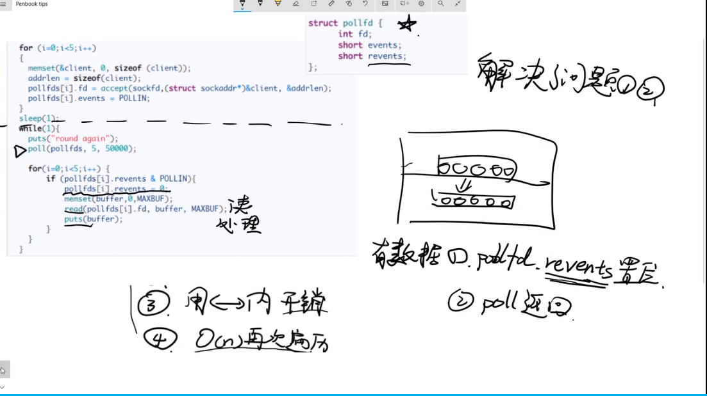
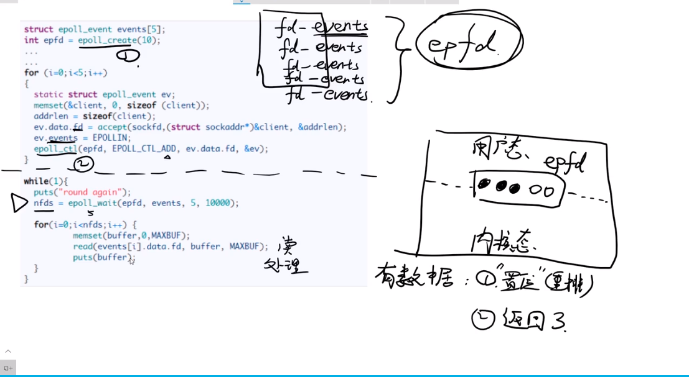
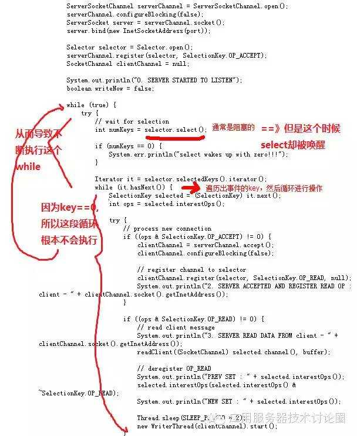

## OS
### 保护模式
1. OS启动会加载kernal，在CPU中加载GDT（全局描述符表），指定内核空间和用户空间内存。
2. 用户程序无法直接访问硬件，只有kernal才能操作硬件。用户专内核会中断（int 0x80软中断）,中断指令0~255。内核有中断表
3. 用户程序中断指令->cpu保存用户内存数据->kernal指令执行->内核调用硬件
4. IO设备也会发出中断指令
5. strace -ff -o <输出文件名> <启动指令>  
6. netstat -natp
7. cd /proc/<进程号>    task线程     fd文件描述符
### IO
1. jvm -> kernel
2. socket(返回fd1)->bind->listen->accept（如果获得连接，返回连接的fd2，否则阻塞）->recv->阻塞等待发来信息
3. BIO CONN-THREAD
4. NIO
5. socket 3->bind(3,8090)->lisen(3)->fcntl(3,nonblock)->accept循环，返回-1|5->fcntl(5,nonblock)->recv(5)
6. select->poll->epoll
### NIO
1. netty使用Nio技术，jdk的NIO存在epoll空轮询bug，即在selector被触发，但是轮询没有结果为空，也没有wakeup或新消息，则会发生空轮询，CPU100%。
2. netty的解决办法是对selector的空轮询进行计数，当一个时间周期内发生一定数量的空轮询，则判断发生bug，就将原selector上注册的socketChannel注册到新selector上，并注销原selector。
3. 
4. jdk1.4中BIO在accept与recv有两次阻塞
5. jdk1.8中BIO使用的是poll，只是只放了一个fd
6. epoll优点：1、epfd在内核空间，减少数据在用户空间和内核空间切换传输。2、每次事件到来，数据先存在DMA，且事件的fd进行置位，内核不必遍历fd集合，然后返回给用户空间。