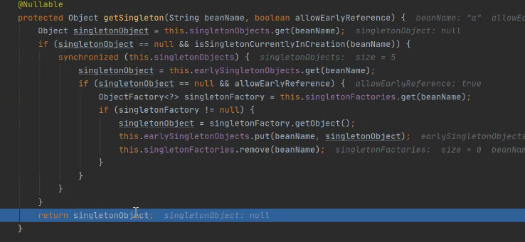

### 什么是循环依赖
1. 两个bean的属性相互持有对象引用。
1. 自动赋值：set、构造器、autowaird
2. set方式循环依赖可以以三级缓存解决
### 怎么解决循环依赖
1. singletonObjects、earlySingletonObjects、singletonFactories。三级缓存
2. 获取BeanA。先从一级缓存中尝试获取，不存在，creatBean最后使用BeanUtils进行反射创建实例（一个普通对象）。然后放入三级缓存（beanName和一个函数）
3. 开始配置对象的属性，发现存在一个BeanB的引用
4. 这个引用类型为RuntimeBeanReference
5. beanFactory。getBean(),开始获取这个BeanB，走之前获取Bean的流程，放入三级缓存（beanName和函数）
6. 类似A的流程，在为B属性赋值时发现存在对BeanA的引用。
7. 此时AB都已实例化，但都没有初始化完成，创建中
8. 第二次尝试获取A，一级缓存不存在，从三级缓存中获取，获得当时放入的函数。
9. 将函数对象执行getOgject(),获得singleObject，放入二级缓存，并返回这个对象，为B的属性进行赋值。
10. 此刻A在二级缓存，B在三级缓存
11. 之后BeanB完成初始化，将B放入一级缓存，清除其他缓存的B
12. 为A设置属性B，A初始化完成
13. 进行A的BeanPostProcess和init-method
14. 将BeanA放入一级缓存，移除其它缓存的A
15. 开始创建BeanB，直接从一级缓存中获取
### 为什么使用三级缓存
1. 由于Bean实例化时调用构造器，而三级缓存是将实例化和初始化分开，提前将实例化对象暴露出去。所以构造器赋值无法使用循环依赖
2. 一级缓存放实例化且初始化完成的Bean，二级缓存放实例化完成，但未初始化的对象。
3. 二级缓存就可以解决循环依赖，但三级缓存是为了创建代理对象而存在
4. 在三级缓存中放置的是生成具体对象的匿名内部类，这个匿名内部类可能是代理类，也可能是普通实例对象，而使用三级缓存就是为了保证不管是否需要代理对象，都使用的是同一个对象。
5. 也就是三级缓存里放置的是对象的创建过程
6. 