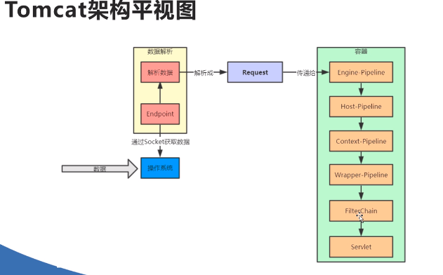
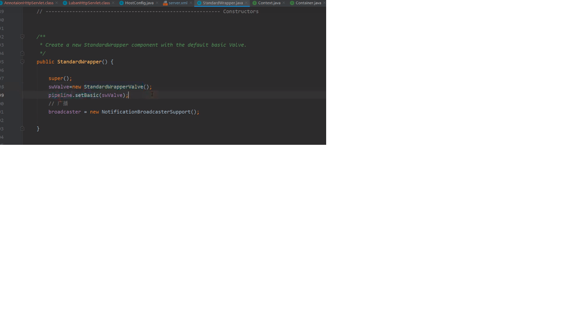
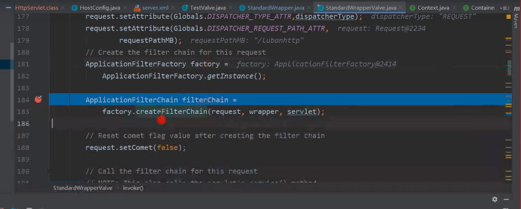
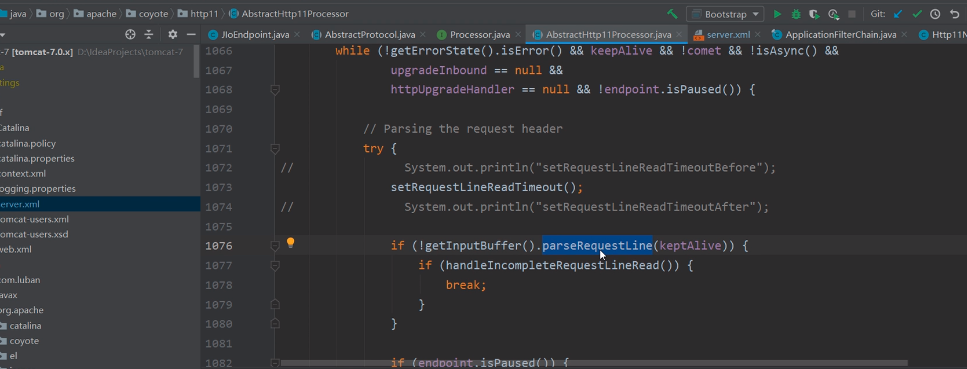

# Tomcat
## tomcat是一个Servlet容器
1. tomcat的server.xml文件中可以看到tomcat的容器结构。
2. 根据tomcat中的Contanir接口，发现有Engine、Host、Wrapper、Context四个接口实现了Container接口
3. 即Engine容器内有Host，Host容器内有Context，Context容器内有Wrapper，Wrapper内有Servlet。
## 请求如何到达Servlet
1. tomcat会将发过来的请求包装成Request，最终注入到servlet的doGet()或doPost()。
2. 使用的Request在实际使用中，会使用一个RequestFacade，采用外观方法模式保护Request
3. 在request传输到servlet过程中，会经历一系列层次的Pipeline（内部的valve，可在server.xml中定义，比如日志)和filter最终到达servlet。
4. 
## 从容器到达servlet
1. request对象最终到达servlet，那tomcat是如何调用servlet的doPost()的。
2. 在Wrapper的pipeline中，tomcat在其末端定义了一个valve。这个阀门会在最后执行。
3. 
4. 所有的valve都可以通过invoke方法中处理自己的逻辑，并调用getNext().invoke(request,respones)调用下一个valve
5. 在这个末端swValve的invoke中 servlet = wrapper.allocate() 分配了对应的servlet，其中是以反射的方式获得对应servlet的实例对象
6. 接下来创建一个过滤器链filterChain,servlet处于这个链的中间，被过滤器包围
7. 
8. filterChain.doFilter(request.getRequset(),response.getResponse())中,执行所有filter和对应servlet的方法。
9. 在request.getRequset()中，将request对象包装成RequestFacade对象。证明Servlet和Filter中使用的都是requsetFacade对象。
9. 过滤器通过dofilter()调用下一个过滤器
10. 通过执行过滤器链的doFilter方法，最终调用到 servlet.service(request,response)
11. 这个方法是servlet对象的父类HttpServlet的抽象方法。在这个方法中，判断了请求的类型是Get还是Post还是Put等等，并调用子类servlet的对应doXXX()。
12. 最后servlet中定义的方法被执行。

## 数据如何到request对象
1. 在tomcat中有AbstractEndpiont，实现它的多个类分别以不同的IO方式、不同协议与客户端建立连接
2. 获得连接后进行包装socket，交给线程池处理
3. 线程池中获取InputStream后，解析
4. 以http协议解析出数据，设置到request对象中
5. 
