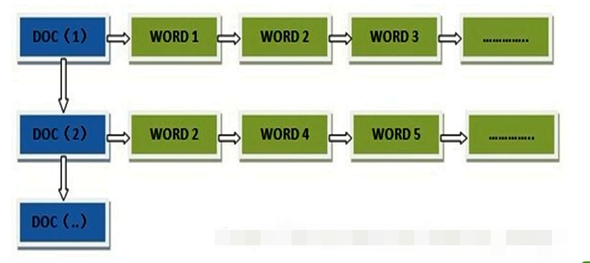
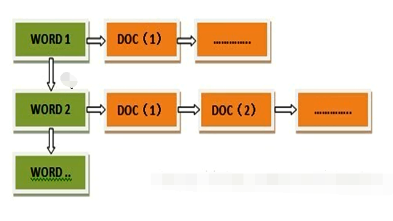
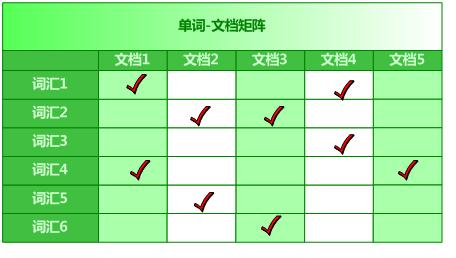
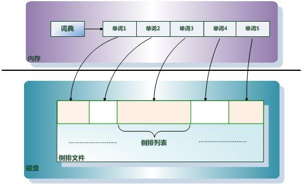
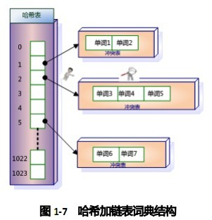
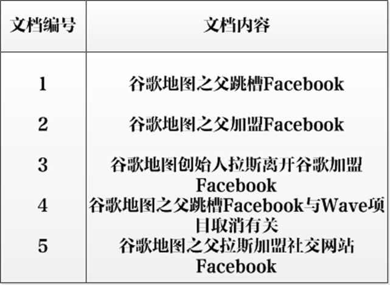
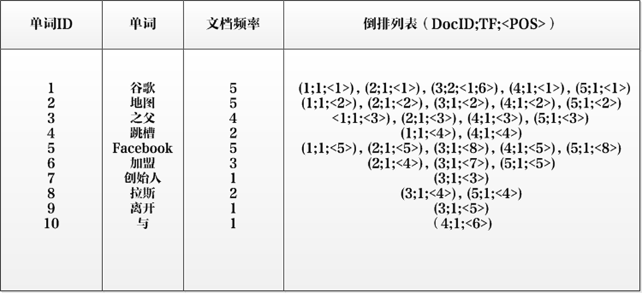

## 什么是倒排索引
##### 正向索引（forward index），反向索引（inverted index）
1. 正向索引：一般的索引，如mysql索引。通过文档，获得单词。
2. 
3. 反向索引:通过单词获得对应的文档。如：通过关键词在搜索引擎查找网页。
4. 
##### 倒排索引的抽象结构
1. 
2. 正如上图所示，倒排索引的结构就是通过单词获得对应的文档
3. 从纵向即文档这个维度来看，每列代表文档包含了哪些单词，比如文档1包含了词汇1和词汇4，而不包含其它单词。从横向即单词这个维度来看，每行代表了哪些文档包含了某个单词。比如对于词汇1来说，文档1和文档4中出现过单词1，而其它文档不包含词汇1。矩阵中其它的行列也可作此种解读。
4. 搜索引擎的索引其实就是实现“单词-文档矩阵”的具体数据结构。可以有不同的方式来实现上述概念模型，比如“倒排索引”、“签名文件”、“后缀树”等方式。但是各项实验数据表明，“倒排索引”是实现单词到文档映射关系的最佳实现方式，所以本博文主要介绍“倒排索引”的技术细节。
##### 倒排索引的基本概念
* 文档(Document)：一般搜索引擎的处理对象是互联网网页，而文档这个概念要更宽泛些，代表以文本形式存在的存储对象，相比网页来说，涵盖更多种形式，比如Word，PDF，html，XML等不同格式的文件都可以称之为文档。再比如一封邮件，一条短信，一条微博也可以称之为文档。在本书后续内容，很多情况下会使用文档来表征文本信息。

* 文档集合(Document Collection)：由若干文档构成的集合称之为文档集合。比如海量的互联网网页或者说大量的电子邮件都是文档集合的具体例子。

* 文档编号(Document ID)：在搜索引擎内部，会将文档集合内每个文档赋予一个唯一的内部编号，以此编号来作为这个文档的唯一标识，这样方便内部处理，每个文档的内部编号即称之为“文档编号”，后文有时会用DocID来便捷地代表文档编号。

* 单词编号(Word ID)：与文档编号类似，搜索引擎内部以唯一的编号来表征某个单词，单词编号可以作为某个单词的唯一表征。

* 倒排索引(Inverted Index)：倒排索引是实现“单词-文档矩阵”的一种具体存储形式，通过倒排索引，可以根据单词快速获取包含这个单词的文档列表。倒排索引主要由两个部分组成：“单词词典”和“倒排文件”。

* 单词词典(Lexicon)：搜索引擎的通常索引单位是单词，单词词典是由文档集合中出现过的所有单词构成的字符串集合，单词词典内每条索引项记载单词本身的一些信息以及指向“倒排列表”的指针。

* 倒排列表(PostingList)：倒排列表记载了出现过某个单词的所有文档的文档列表及单词在该文档中出现的位置信息，每条记录称为一个倒排项(Posting)。根据倒排列表，即可获知哪些文档包含某个单词。

* 倒排文件(Inverted File)：所有单词的倒排列表往往顺序地存储在磁盘的某个文件里，这个文件即被称之为倒排文件，倒排文件是存储倒排索引的物理文件。
* 

     关于这些概念之间的关系，通过图可以比较清晰的看出来。
##### 单词词典
* 单词词典是倒排索引中非常重要的组成部分，它用来维护文档集合中出现过的所有单词的相关信息，同时用来记载某个单词对应的倒排列表在倒排文件中的位置信息。在支持搜索时，根据用户的查询词，去单词词典里查询，就能够获得相应的倒排列表，并以此作为后续排序的基础。
* 对于一个规模很大的文档集合来说，可能包含几十万甚至上百万的不同单词，能否快速定位某个单词，这直接影响搜索时的响应速度，所以需要高效的数据结构来对单词词典进行构建和查找，常用的数据结构包括哈希加链表结构和树形词典结构。
* 主体部分是哈希表，每个哈希表项保存一个指针，指针指向冲突链表，在冲突链表里，相同哈希值的单词形成链表结构。之所以会有冲突链表，是因为两个不同单词获得相同的哈希值，如果是这样，在哈希方法里被称做是一次冲突，可以将相同哈希值的单词存储在链表里，以供后续查找。
* 
##### 示例
* 
* 
* 单词ID：记录每个单词的单词编号；
* 单词：对应的单词；
* 文档频率：代表文档集合中有多少个文档包含某个单词
* 倒排列表：包含单词ID及其他必要信息
* DocId：单词出现的文档id
* TF：单词在某个文档中出现的次数
* POS：单词在文档中出现的位置
* 以单词“加盟”为例，其单词编号为6，文档频率为3，代表整个文档集合中有三个文档包含这个单词，对应的倒排列表为{(2;1;<4>),(3;1;<7>),(5;1;<5>)}，含义是在文档2，3，5出现过这个单词，在每个文档的出现过1次，单词“加盟”在第一个文档的POS是4，即文档的第四个单词是“加盟”，其他的类似。
* 这个倒排索引已经是一个非常完备的索引系统，实际搜索系统的索引结构基本如此。
